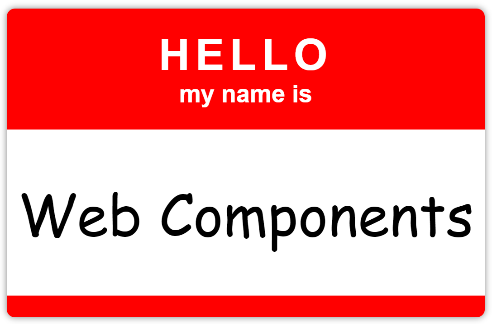

# Hello Web Components

If you've heard about Web Components but have never built one yourself, you've come to the right place. The time has come! Let's build a Web Component together!

When I have the opportunity to teach folks about Web Components, I usually like to start with something simple that many of us know from the "real world." So, let's build a Web Component "name tag" that looks something like this…



## Step Zero

1. Start with a basic HTML document that has a JS module script pointing to a (temporarily) empty JavaScript file.
2. In the body of the document, add a name-tag element with the text "Web Components" as its content. This is the Web Component that we would eventually like to get working.
3. Start a web server and browse to your HTML file. You should see the text "Web Components" rendered in your browser.

#### index.html

```HTML
<!DOCTYPE html>
<html>
  <head>
    <title>Hello Web Components</title>
  </head>
  <body>
    <name-tag greeting="Hola">Web Components</name-tag>
    <script type="module" src="index.js"></script>
  </body>
</html>
```

#### index.js

```JavaScript
// Nothing here yet. We'll add our Web Component code in the next step.
```

> **NOTE:** If you aren't sure what to use for a web server, you can use [the http-server package for Node.js](https://www.npmjs.com/package/http-server) or something like [the Live Server plugin for VS Code](https://marketplace.visualstudio.com/items?itemName=ritwickdey.LiveServer). Anything that can serve static content will work though.

## Step One

1. In your JavaScript file, declare the behavior for your `name-tag` custom element by creating a class named `NameTag` that extends from `HTMLElement`. All Web Components inherit from `HTMLElement` just like the built-in elements, such as `div`, `span`, and `input`.
2. Register your element with the browser by calling `customElements.define(...)`, providing your desired HTML tag name and the `NameTag` class as arguments.
3. Refresh the browser and you should still see the same text as before. However, if you inspect the `name-tag` element, you will see that it is not only an `HTMLElement` but that its constructor is now `NameTag` as well.

#### index.js

```JavaScript
class NameTag extends HTMLElement {

}

customElements.define('name-tag', NameTag);
```

> **IMPORTANT:** All Web Component tag names must include a hyphen. This functions as a lightweight mechanism for name spacing elements across libraries and also for preventing them from conflicting with any present or future built-in elements, such as the upcoming [selectlist](https://open-ui.org/components/selectlist/).

## Step Two

1. Add a constructor to your class. After the call to `super()`, call `this.attachShadow(...)`  to create a Shadow DOM for your custom element. A Shadow DOM is like having a private HTML document that only your component can render to. Pass the options `{ mode: 'open' }` so that the shadow root and its internal elements are still accessible externally via JavaScript and via the developer tools. 
2. Once the Shadow DOM is attached, you can access this.shadowRoot and set its innerHTML property to the HTML of your choosing.
3. Refresh the browser and observe that your Shadow DOM `innerHTML` content is now rendering but that the content of the element itself, the text "Web Components", is no longer being rendered. Where has it gone?
4. Open the inspector and verify that there's a `#shadow-root` node that you can inspect to see what you provided as `innerHTML`. Note that your content is still in the DOM as well, even though it isn't rendering. The reason it isn't rendering is because the browser does not know how to compose the Light DOM content with the Shadow DOM. We'll fix that next.

#### index.js

```JavaScript
class NameTag extends HTMLElement {
  constructor() {
    super();
    this.attachShadow({ mode: 'open' });
    this.shadowRoot.innerHTML = 'Rendering from Shadow DOM';
  }
}

customElements.define('name-tag', NameTag);
```

> **NOTE:** Using `open` mode is the standard practice for Shadow DOM but you can also use `closed` mode. Make sure you have a strong case for `closed` mode before choosing to go that way though.

## Step Three

1. Revise the HTML that is being placed into the shadow root so that it includes a `<slot>` element. This tells the browser how to compose your Light DOM and Shadow DOM together. The slot provides a location to "project" or render the Light DOM content into the Shadow DOM. The content still exists in the Light DOM, but it is rendered as if it were at the location of the slot.
2. Refresh your browser and observe that now both your Light and Shadow DOM content are properly composed together.

#### index.js

```JavaScript
class NameTag extends HTMLElement {
  constructor() {
    super();
    this.attachShadow({ mode: 'open' });
    this.shadowRoot.innerHTML = 'HELLO <slot></slot>';
  }
}

customElements.define('name-tag', NameTag);
```

> **NOTE:** Many don't find the terms "Light" and "Shadow" DOM particularly intuitive or explanatory. Instead, it may be useful to think of the "Light" DOM as the "Semantic" DOM. The "Shadow" DOM can then be thought of as the "Render" DOM. Shadow DOM is a private document that describes how the element will render itself, without affecting semantics. Most native component models have similar concepts, e.g., Logical vs. Visual trees.

## Step Four

1. To enable our `greeting` attribute to work, we'll need to tell the platform that there is a `greeting` attribute we want to observe. Create a static getter named `observedAttributes` that returns an array of attribute names for the platform to observe. The array should contain the single attribute name: `['greeting']`.
2. Next, implement an `attributeChangedCallback()` that the platform can invoke whenever any of its observed attributes change.
3. Add a property getter/setter to provide property access to the attribute, since most HTML elements have both properties and attributes. This will ensure our custom element feels like anything else in the platform and that it works correctly with popular front-end frameworks that set both attributes and properties. The getter and setter can just delegate to the `getAttribute()` and `setAttribute()` APIs of `HTMLElement`.
4. Extract a `render` function that takes the component as input and call it from the `attributeChangedCallback()` so that it can update its rendering when the element's state changes. Remove the code that set `innerHTML` in the constructor. This is no longer needed.
5. We can also introduce a `connectedCallback()`. The platform will call this when the element is connected to the document. We'll use this to ensure that there is a default value for `greeting` if one wasn't set by the time the element is connected.
6. Refresh the browser to see that the `greeting` attribute is now taking effect. Experiment by using the debug tools to set the greeting property and attribute. Try placing breakpoints in the `attributeChangedCallback()`.

#### index.js

```JavaScript
const render = x => `${x.greeting.toUpperCase()} <slot></slot>`;

class NameTag extends HTMLElement {
  static get observedAttributes() {
    return ['greeting'];
  }

  constructor() {
    super();
    this.attachShadow({ mode: 'open' });
  }

  get greeting() {
    return this.getAttribute('greeting');
  }

  set greeting(value) {
    this.setAttribute('greeting', value);
  }

  connectedCallback() {
    if (!this.greeting) {
      this.greeting = 'Hello';
    }
  }

  attributeChangedCallback(name, oldValue, newValue) {
    this.shadowRoot.innerHTML = render(this);
  }
}

customElements.define('name-tag', NameTag);
```

## Step Five

1. Let's improve our `render` function so that it provides a more realistic structure.
2. Refresh the browser to ensure that the new structure is rendering properly.

#### index.js changes

```JavaScript
const render = x => `
  <div part="header" class="header">
    <h3 part="greeting">${x.greeting.toUpperCase()}</h3>
    <h4 part="message">my name is</h4>
  </div>

  <div part="body" class="body">
    <slot></slot>
  </div>

  <div part="footer" class="footer"></div>
`;
```

> **NOTE:** At this point you may be starting to see the amount of boilerplate involved when creating a Web Component. This is because the Web Component standards provide you with the low-level capabilities to create components, but otherwise have no opinions on how you should implement your component internally. To eliminate boilerplate, you can build your own helper library [as I teach in my course](https://bluespire.com/p/web-component-engineering), or you can use a library like [FAST](https://www.fast.design/) or [Lit](https://lit.dev/).

## Step Six

1. Leveraging Constructible StyleSheets and Adopted StyleSheets, create a `CSSStyleSheet` instance and call `replaceSync` to set its CSS text.
2. In your element constructor, push your custom styles into the existing `adoptedStyleSheets` of the `shadowRoot`.
3. Refresh your browser to see a fully styled component.

#### index.js changes

```JavaScript
const styles = new CSSStyleSheet();
styles.replaceSync(`
  :host {
    --default-color: red;
    --default-radius: 6px;
    --default-depth: 5px;

    display: inline-block;
    contain: content;
    color: white;
    background: var(--color, var(--default-color));
    border-radius: var(--radius, var(--default-radius));
    min-width: 325px;
    text-align: center;
    box-shadow: 0 0 var(--depth, var(--default-depth)) rgba(0,0,0,.5);
  }

  .header {
    margin: 16px 0;
    position: relative;
  }

  h3 {
    font-weight: bold;
    font-family: sans-serif;
    letter-spacing: 4px;
    font-size: 32px;
    margin: 0;
    padding: 0;
  }

  h4 {
    font-family: sans-serif;
    font-size: 18px;
    margin: 0;
    padding: 0;
  }

  .body {
    background: white;
    color: black;
    padding: 32px 8px;
    font-size: 42px;
    font-family: cursive;
  }

  .footer {
    height: 16px;
    background: var(--color, var(--default-color));
    border-radius: 0 0 var(--radius, var(--default-radius)) var(--radius, var(--default-radius));
  }
`);
```

#### index.js changes

```JavaScript
constructor() {
  super();
  this.attachShadow({ mode: 'open' });
  this.shadowRoot.adoptedStyleSheets.push(styles);
}
```

Congratulations! You've created a W3C standard platform Web Component with Vanilla JS! It has an encapsulated Shadow DOM for HTML and CSS rendering, attribute reactivity, and lifecycle integration. Read on to go a bit deeper and discover some additional learning resources and libraries.

## Going Deeper

### CSS Custom Properties (aka CSS Variables)

A common way to enable custom elements to be styled is to base component styles on CSS Custom Properties (aka CSS Variables). Custom Properties are declared with the `--` prefix and referenced with the `var(...)` function. When referencing a variable, you can also provide a fallback value, which itself can be another variable. You can see this technique used throughout the CSS above. To play with this, create several `<name-tag>` elements on your page and then use the browser's style inspector to set `--color`, `--depth`, and `--radius` properties on individual elements or on parent elements. Even though Shadow DOM encapsulates styles, CSS Custom Properties "pierce" the Shadow DOM boundary by default. This makes it possible to create a theming system that works across an entire component library or application. And remember, CSS Custom Properties can be used together with CSS `calc(...)` for amazing effects.

* [Read more about CSS Custom Properties on MDN.](https://developer.mozilla.org/en-US/docs/Web/CSS/Using_CSS_custom_properties)
* [Read more about CSS Calc on MDN.](https://developer.mozilla.org/en-US/docs/Web/CSS/calc)

### Shadow DOM CSS Selectors

Shadow DOM styles can also leverage special selectors, such as the `:host`, which targets the element itself. It's a best practice to set up host styles for the default `display` and `disabled` states. Check out the `contain` CSS property for ways to improve component render performance as well. If you have special styles for elements placed inside the content of your element, you can specify those by using the `::slotted()` selector.

* [Read more about :host on MDN.](https://developer.mozilla.org/en-US/docs/Web/CSS/:host)
* [Read more about ::slotted on MDN.](https://developer.mozilla.org/en-US/docs/Web/CSS/::slotted)
* [Read more about CSS Contain on MDN.](https://developer.mozilla.org/en-US/docs/web/css/contain)

### CSS Parts

You may have noticed that several elements in the above shadow DOM have a `part` attribute. This allows a web component developer to declare parts of the component that can be styled externally by consumers of the component. To try it out, create several `<name-tag>` elements on your page, each with a different `class`. Then create CSS that targets parts based on a class selector and adjusts the greeting styles. Here's what that might look like:

```css
.large-greeting::part(greeting) {
  font-size: 64px;
}
```

* [Read more about ::part on MDN.](https://developer.mozilla.org/en-US/docs/Web/CSS/::part)

### The Web Component Lifecycle

In our `NameTag` element, we used the `connectedCallback(...)`, which is one of the standard Web Component lifecycle hooks. But it's not the only one. Here's a list of available lifecycle callbacks you can use in your components:

| Callback | Description |
| :-- | :-- |
| `constructor()` | Runs when the element is created or upgraded. |
| `connectedCallback()` | Runs when the element is inserted into the DOM. |
| `disconnectedCallback()` | Runs when the element is removed from the DOM. |
| `attributedChangedCallback(attrName, oldValue, newValue)` | Runs any time one of the element's custom attributes changes. |
| `adoptedCallback()` | Runs when the element is moved from its current document into a new document via a call to the `adoptNode(...)` API. |

## Next Steps

We've only just scratched the surface of Web Components in this little tutorial. To learn more, please consider enrolling in my Web Component Engineering course.

[](https://bluespire.com/p/web-component-engineering)

Join me as I explore UI Engineering through the application of a broad range of modern Web Standards. With Web Components as its anchor, this course covers dozens of topics that professional UI Engineers and Designers can use on a daily basis. From DOM APIs and Web Components to modern CSS, Accessibility, Forms, Design Systems, Applications, Tools and more. Regardless of your level of experience, this course is the Web Platform resource you've been looking for. Group/team rates and PPP discounts available upon request.
